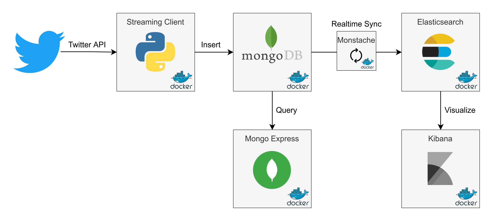

# Twitter Stream – Mongo + Docker + ELK

## Features

* Dockerized realtime tweet streaming to MongoDB based on search rules;
* MongoDB collection is continuosly synced with an Elasticsearch index using <a href="https://github.com/rwynn/monstache">Monstache</a>;
* MongoDB can be queried with <a href="https://github.com/rwynn/monstache">Mongo Express</a>, a web-based MongoDB admin interface;
* Kibana is used to visualize and search tweets.

